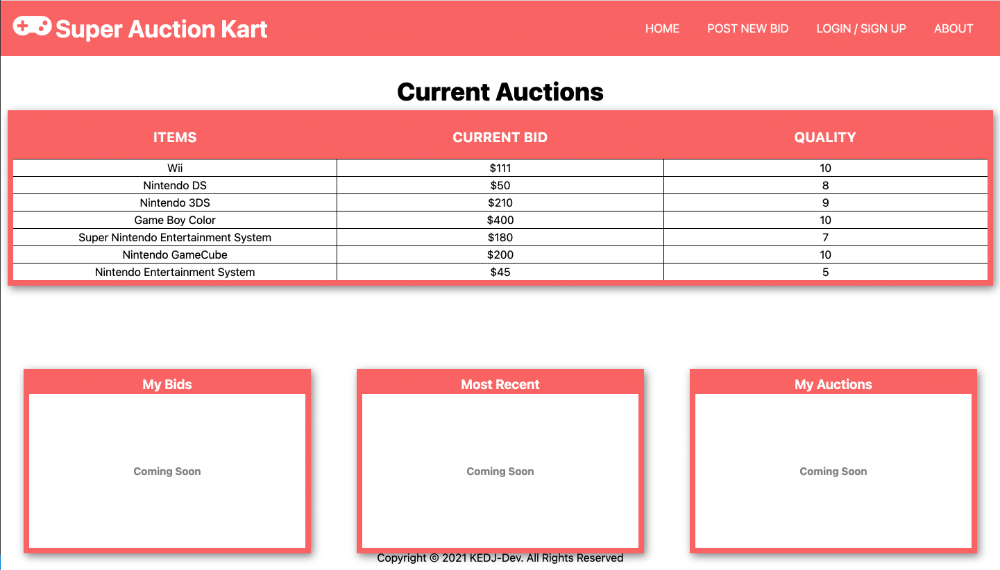

# Project 2 - Super Auction Kart

## Background

This was a project for the UofT Bootcamp.

## Table of Contents
[Description](#description)\
[Motivation](#motivation)\
[User Story](#user-story)\
[Technologies](#technologies)\
[License](#license)\
[Process](#process)\
[Screen Shot](#screen-shot)\
[Links](#links)


## Description

Super Auction Cart is an auction site strictly for Nintendo products.  It reduces the amount of time collector's spend searching the internet for Nintendo items.  Super Auction Cart also helps reduce the amount of time a collector spends listing their items to sell too.

## Motivation

We have friends that use auction and buy/sell sites for Nintendo products.  Super Auction Cart brings them to one place.

## User Story

```
AS A avid Nintendo fan who likes to buy and sell used Nintendo products
I WANT to save time and go to a single site to buy and sell Nintendo products
SO THAT I can spend less time searching and posting items and more time enjoying my Nintendo collection
```

## Technologies

* HTML & CSS & Tailwinds
* JavaScript
* MySQL
* Dependencies: Bcrypt, Dotenv, Express + Handlebars, MySQL2, and Sequelize


## License

[MIT License](https://choosealicense.com/licenses/mit/)

## Process

* For this project we started from scratch, but had a team.  To start we divided front-end and back-end tasks to team members and created a wire frame.
* From there we followed the MVC paradigm until we had a MVP. 
* Our biggest challenges for this project was being unable to use an array as a data type in Sequelize, getting the layout correct with CSS, getting use to using handlebars template engine because it was new to us.
* Our successes for this project was overcoming the aforementioned challenges, responsive Navbar design, and working well as a team.
* Credit to the collabrators on this project.

## Screen Shot



## Links

Repository: https://github.com/harviator/project-2-auction-site \
Deployed: https://enigmatic-taiga-76650.herokuapp.com/